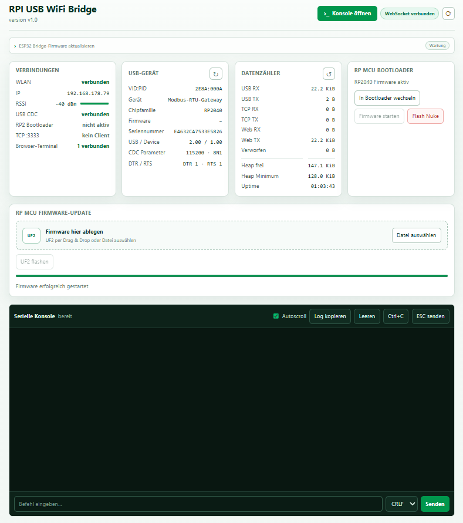
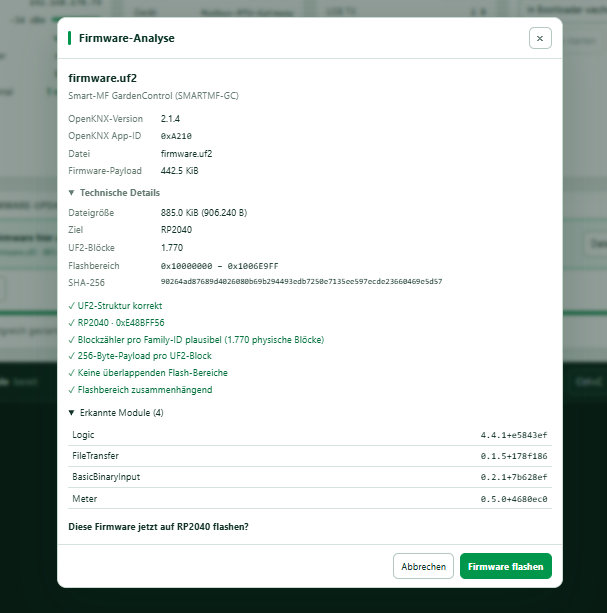
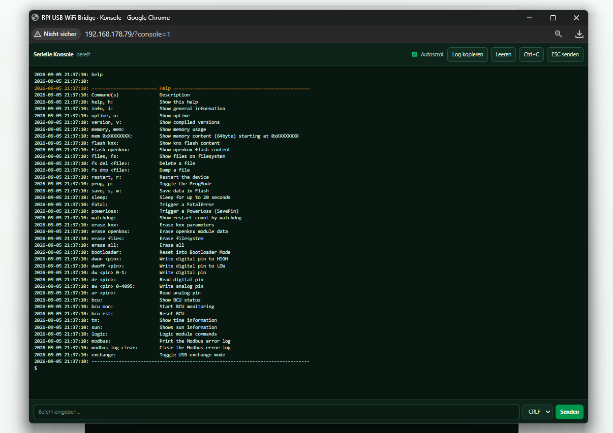

# RPI USB WiFi Bridge v1.0

[Deutsch](#deutsch) | [English](#english)

---

## Deutsch

Die **RPI USB WiFi Bridge** verbindet ein RP2040-/RP2350-/RP2354-Gerät per USB mit dem WLAN.
Als Hardware wird ein **ESP32-S3 mit USB Host und 16 MB Flash** verwendet.

### Funktionen

- Serielle USB-Konsole im Browser
- Konsole optional in einem eigenen Browserfenster
- Raw TCP / RFC2217 auf Port `3333`
- RP2040/RP2350 BOOTSEL-Unterstützung
- UF2-Dateien im Browser prüfen und flashen
- ESP32-Firmware per Web-OTA aktualisieren
- USB-Status und Diagnose im Browser
- WLAN-Einrichtung über einen eigenen Access Point

### Screenshots

#### Weboberfläche



#### Firmware-Analyse



#### Browser-Konsole



### WLAN einrichten

Beim ersten Start öffnet die Bridge einen Access Point:

```text
RPI-USB-WiFi-XXXXXX
```

Mit diesem WLAN verbinden. Die Einrichtungsseite sollte automatisch erscheinen.
Falls nicht:

```text
http://192.168.4.1
```

WLAN auswählen, Passwort eingeben und speichern. Die Daten werden im NVS gespeichert.

### ESP-IDF installieren

Benötigt wird **ESP-IDF 6.1.x**.

Unter Windows zuerst den Espressif Installation Manager installieren:

```powershell
winget install Espressif.EIM
```

Danach EIM öffnen, **ESP-IDF 6.1.x** installieren und das ESP-IDF-Terminal starten.

Prüfen:

```powershell
idf.py --version
```

### Bauen und flashen

Bei einem frischen Projekt:

```powershell
idf.py set-target esp32s3
idf.py build
idf.py flash
```

`set-target` nur beim ersten Einrichten des Projekts verwenden.

ESP32 komplett löschen, inklusive WLAN-Daten:

```powershell
idf.py erase-flash
idf.py flash
```

### Lizenz

MIT-Lizenz. Siehe [LICENSE](LICENSE).
Hinweise zu Drittanbieter-Dateien stehen in [THIRD_PARTY_NOTICES.md](THIRD_PARTY_NOTICES.md).

---

## English

**RPI USB WiFi Bridge** connects an RP2040/RP2350/RP2354 device to WiFi through USB.
It uses an **ESP32-S3 with USB Host and 16 MB flash**.

### Features

- USB serial console in the browser
- Console can also open in a separate browser window
- Raw TCP / RFC2217 on port `3333`
- RP2040/RP2350 BOOTSEL support
- Check and flash UF2 files from the browser
- Update ESP32 firmware with Web OTA
- USB status and diagnostics in the browser
- WiFi setup through its own access point

### Screenshots

#### Web interface


#### Firmware analysis


#### Browser console


### WiFi setup

On first start, the bridge creates an access point:

```text
RPI-USB-WiFi-XXXXXX
```

Connect to it. The setup page should open automatically.
If it does not:

```text
http://192.168.4.1
```

Select your WiFi, enter the password and save. The credentials are stored in NVS.

### Install ESP-IDF

This project needs **ESP-IDF 6.1.x**.

On Windows, first install the Espressif Installation Manager:

```powershell
winget install Espressif.EIM
```

Then open EIM, install **ESP-IDF 6.1.x** and start the ESP-IDF terminal.

Check the version:

```powershell
idf.py --version
```

### Build and flash

For a fresh project:

```powershell
idf.py set-target esp32s3
idf.py build
idf.py flash
```

Use `set-target` only when setting up the project for the first time.

To erase the full ESP32 flash, including saved WiFi data:

```powershell
idf.py erase-flash
idf.py flash
```

### License

MIT License. See [LICENSE](LICENSE).
Third-party notices are listed in [THIRD_PARTY_NOTICES.md](THIRD_PARTY_NOTICES.md).
